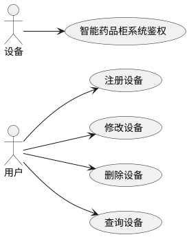
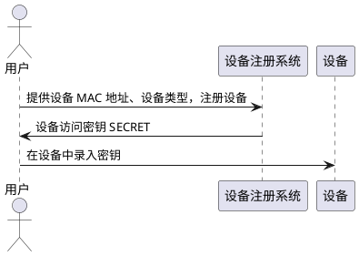
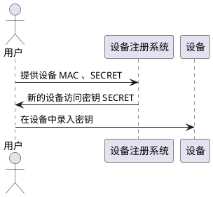
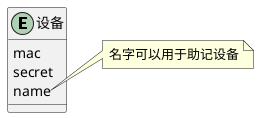

# 设备

## 定义

智能药品柜中使用到的传感器（Sensor）、药品柜（Cabinet）、柜前终端（Terminal）统称为设备（Device）。

设备如果想要接入智能药品柜系统，首先需要在系统中注册设备。

## 用例

## 设备注册

## 设备访问智能药品柜系统

设备凭借 `MAC` 与 `SECRET` 进行 HTTP Basic 认证。

## 设备管理

用户凭借产品 `MAC` 与 `SECRET` 可以重新生成设备密钥。

## 模式

