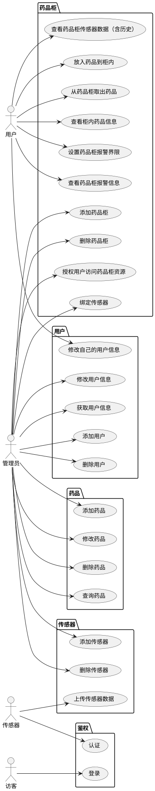
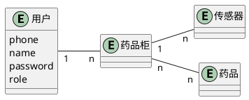

# 智能药品柜系统

## 用例

```plantuml
@startuml
left to right direction
actor 管理员 as Admin
actor 用户 as User
actor 访客 as Guest

actor 传感器 as Sensor

package 用户 {
  Admin --> (添加用户)
  Admin --> (删除用户)
  Admin --> (修改用户信息)
  Admin --> (获取用户信息)
  User --> (修改自己的用户信息)
}

package 鉴权 {
  Guest --> (登录)
  Sensor --> (认证)
}

package 药品柜 {
  ' 药品柜资源管理
  Admin --> (添加药品柜)
  Admin --> (删除药品柜)
  Admin --> (授权用户访问药品柜资源)

  ' 传感器
  Admin --> (绑定传感器)
  User --> (查看药品柜传感器数据（含历史）)

  ' 药品数据
  User --> (放入药品到柜内)
  User --> (从药品柜取出药品)
  User --> (查看柜内药品信息)

  ' 报警数据
  User --> (设置药品柜报警界限)
  User --> (查看药品柜报警信息)
}

package 传感器 {
  Admin --> (添加传感器)
  Admin --> (删除传感器)
  Sensor --> (上传传感器数据)
}

package 药品 {
  Admin --> (添加药品)
  Admin --> (修改药品)
  Admin --> (删除药品)
  Admin --> (查询药品)
}
@enduml
```

## 模式与关系

```plantuml
@startuml
left to right direction
entity 用户 {
  phone
  name
  password
  role
}
entity 药品柜 {}
entity 传感器 {}

entity 药品 {}

用户 "1" -- "n" 药品柜
药品柜 "1" -- "n" 传感器
药品柜 "n" -- "n" 药品
@enduml
```
