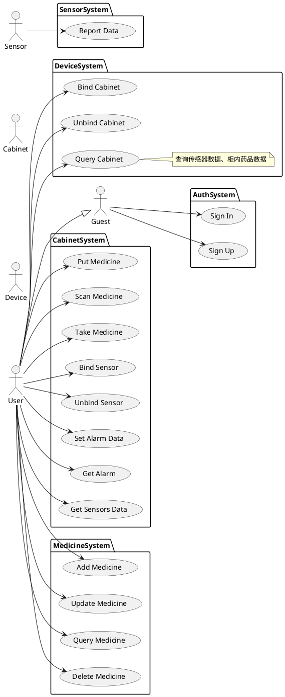
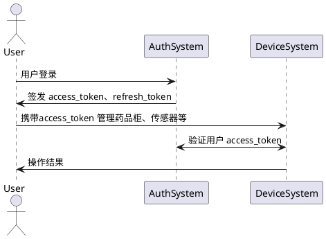
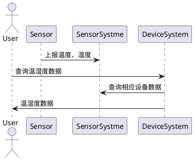
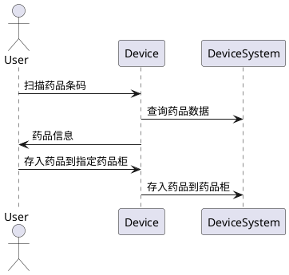

# 项目设计

## 老师例子的接口

- 登录
- 注册
- 添加药品
- 提交温度、湿度数据
- 获取温度、湿度数据
- 获取药品数据
- 查询药品数据
- 扫描药品数据
- 绑定设备
- 获取温度历史数据
- 获取湿度历史数据
- 删除药柜
- 是否有报警信息

## 用例

```plantuml
@startuml
left to right direction

actor Guest
actor User
User  --|> Guest
actor Device
actor Cabinet
actor Sensor

package AuthSystem {
  Guest --> (Sign In)
  Guest --> (Sign Up)
}

package DeviceSystem {
  User --> (Bind Cabinet)
  User --> (Unbind Cabinet)
  User --> (Query Cabinet)
  note right of (Query Cabinet) : 查询传感器数据、柜内药品数据
}

package CabinetSystem {
  User --> (Put Medicine)
  User --> (Scan Medicine)
  User --> (Take Medicine)
  User --> (Bind Sensor)
  User --> (Unbind Sensor)
  User --> (Set Alarm Data)
  User --> (Get Alarm)
  User --> (Get Sensors Data)
}

package SensorSystem {
  Sensor --> (Report Data)
}

package MedicineSystem {
  User --> (Add Medicine)
  User --> (Update Medicine)
  User --> (Query Medicine)
  User --> (Delete Medicine)
}
@enduml
```

## 时序

### 基础交互流程

```plantuml
@startuml
actor User
participant AuthSystem
participant DeviceSystem

User -> AuthSystem : 用户登录
AuthSystem -> User : 签发 access_token、refresh_token
User -> DeviceSystem : 携带access_token 管理药品柜、传感器等
DeviceSystem <-> AuthSystem : 验证用户 access_token
DeviceSystem -> User : 操作结果
@enduml
```

### 传感器数据

```plantuml
@startuml
actor User
Sensor -> SensorSystme : 上报温度、湿度
User -> DeviceSystem : 查询温湿度数据
DeviceSystem -> SensorSystme : 查询相应设备数据
DeviceSystem -> User : 温湿度数据
@enduml
```

### 药品柜操作

```plantuml
@startuml
actor User

User -> Device : 扫描药品条码
Device -> DeviceSystem : 查询药品数据
Device -> User : 药品信息
User -> Device : 存入药品到指定药品柜
Device -> DeviceSystem: 存入药品到药品柜
@enduml
```

## ER
